[back to README](./README.md)
# Features

## Pages

The website has the following pages:
- Home page
- Lessons page
- Game page
- Team page
- Log in page
- Highscore page
- Sign up page

## Navbar
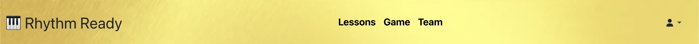

Navbar has the following links:
- Rythm Ready logo (links to home page)
- Lessons page
- Game page
- Team page
- Log in (when logged in, there's a dropdown menu with links to your highscore and log out)
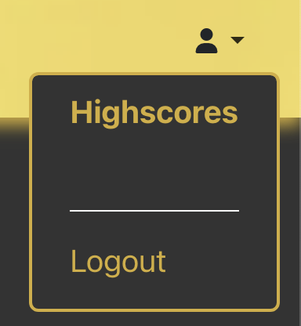
- Sign up

On smaller screens, the navbar collapses into a toggle with side menu that slides from the left when clicked
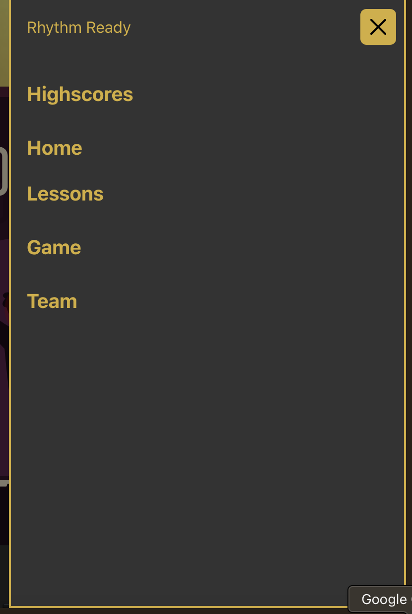

## Footer
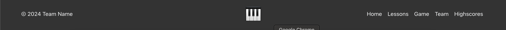

Footer contains a copyright text, piano icon that redirects to the home page when clicked, and links to the lessons, game, and team pages, as well as highscores page when logged in.

## Home page
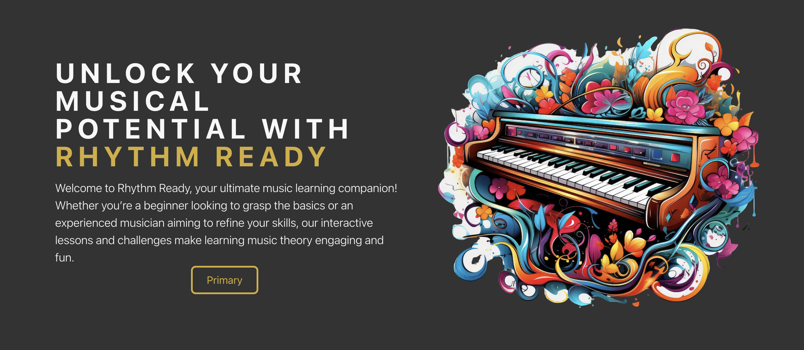

The home page displays the hero section with the description of the website's purpose and an image of a colourful piano.

## Lessons page

The lessons page contains three lessons under toggle tabs. Lesson 1 is about the musical alphabet, lesson 2 on basic scales, and lesson 3 on chords. It also contains a playable piano that you can click using your mouse or press the corresponding key.

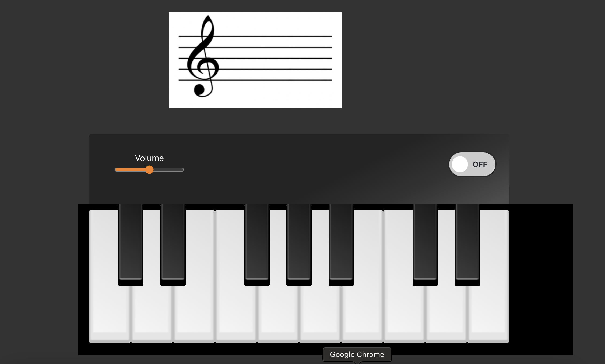

## Game page
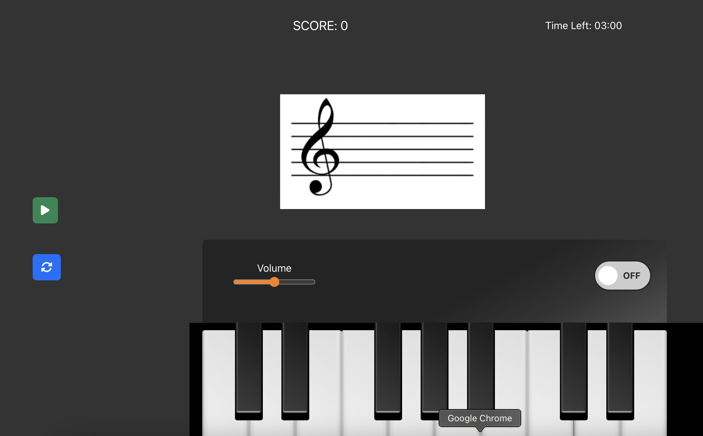

The game page allows users to practice the notes they have learned. The start button starts a timer and displays a random note on the screen and the users will have to click or press the correct key on the piano. They get one score for every correct answer and minus one for every wrong answer. Their current score is displayed. It also has restart button to start a new challenge.

## Team page
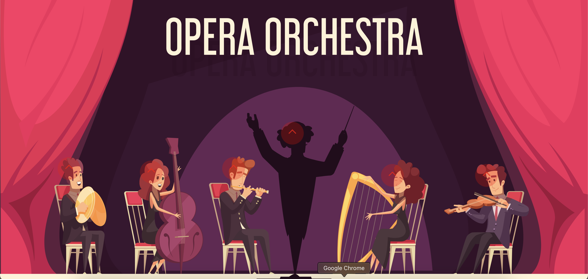

This page contains links to the GitHub profiles of the contributors of this project.

## Log in page
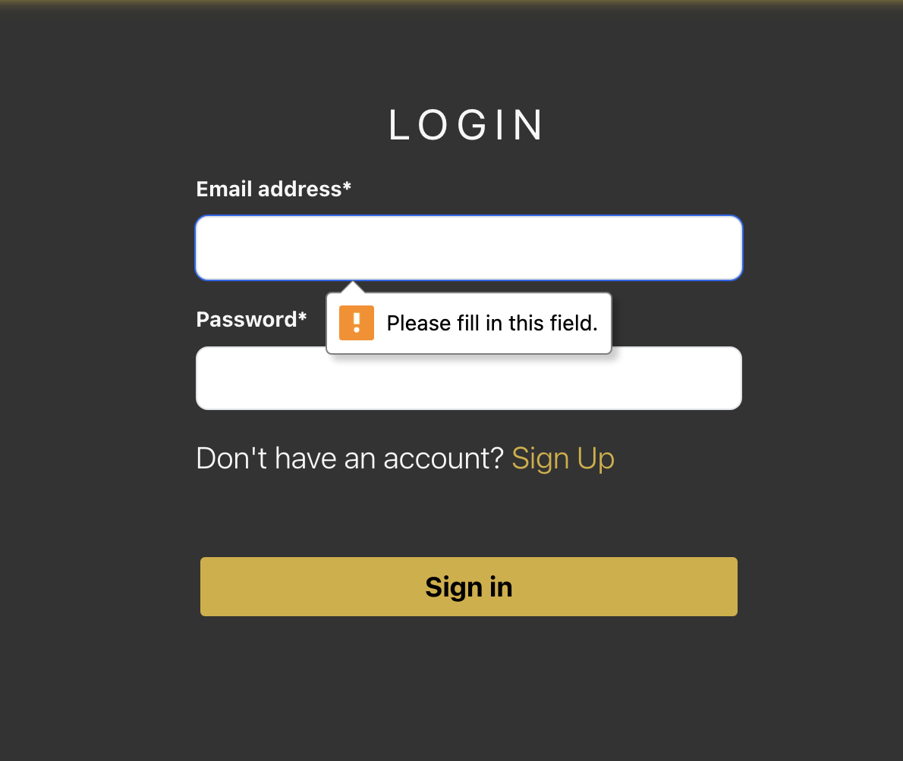

The login page dispays the login form. An error message pops up if the username and password are not filled in and the sign in button is pressed. 

## Highscore page
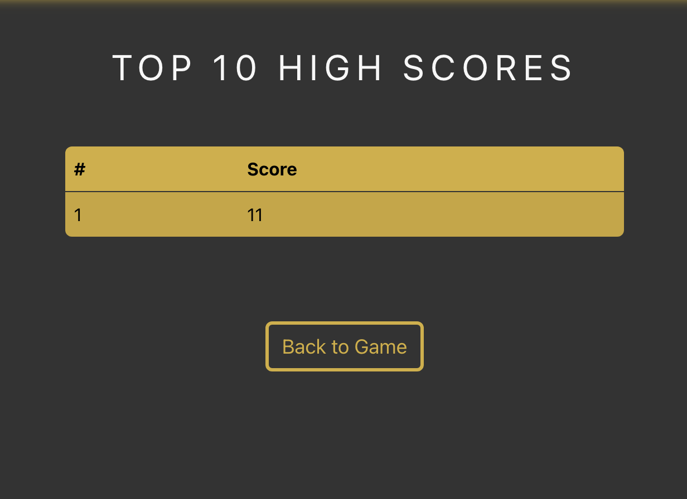

This page contains your highscores, as well as a button to go back to the game page.

## Log out
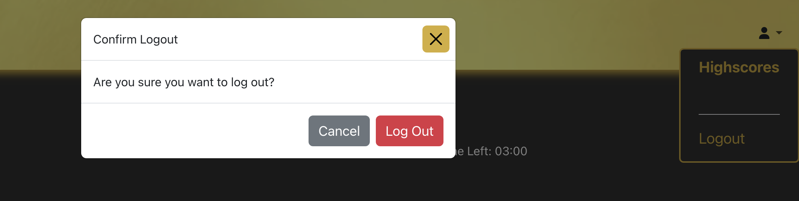

When you click log out and confirmation message pops up and when you confirm log out, you are directed back to the home page.

## Sign up page
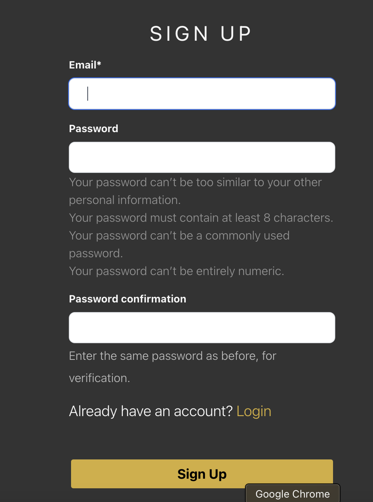

This page shows the form for signing up. An error message pops up if the input is invalid or missing.

---

# Future Features 

* It would be nice to have a user profile area that saves the users current gameplay score  and a graph that tracks this over time so they can visualise their progress. 
* More lessons could be added for inclusion of different user levels. 
* The ability to show the user piano notes for a song and have the user follow along on the digital piano would be advantageous. 
* More challenges could be added to allow the user to test new skills.

[back to README](./README.md)
