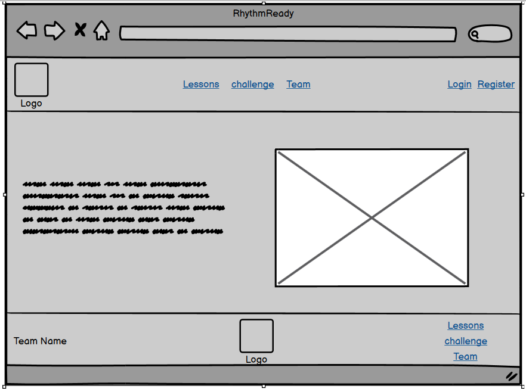
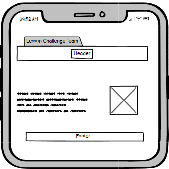
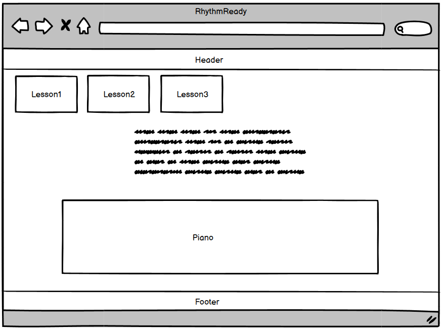
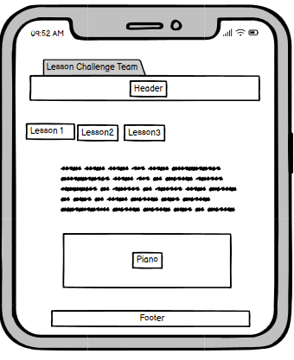
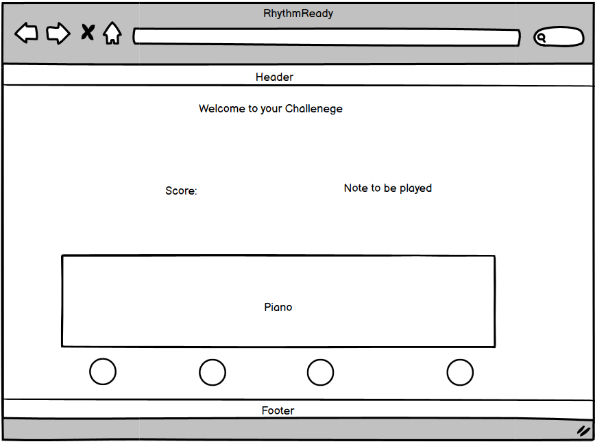
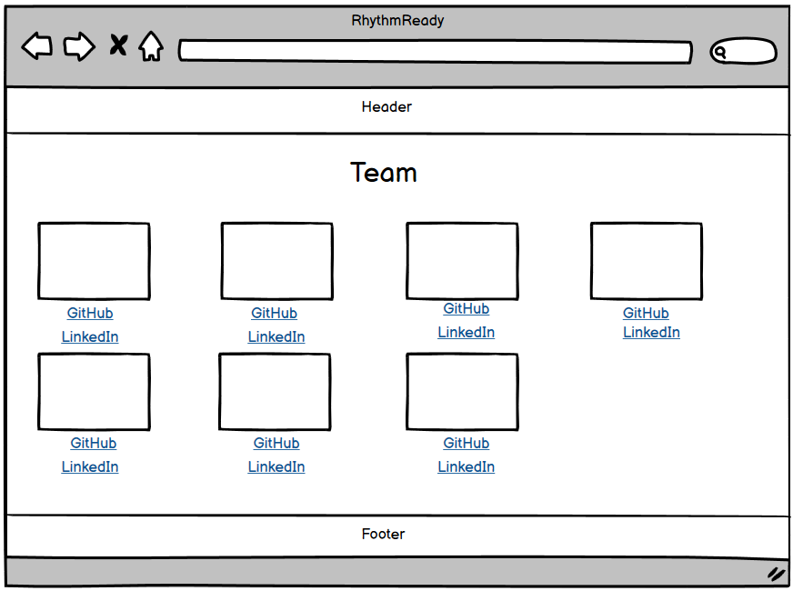
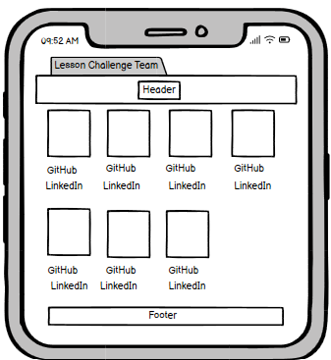
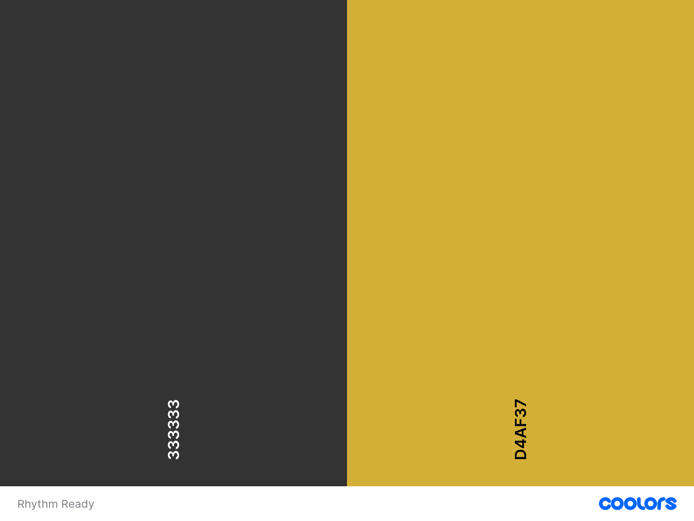

# Classical Music Hackathon

# Rhythm Ready


Rhythm Ready is a learning app to teach beginners how to play notes, scales and chords on a piano. Users of this application can partake in lessons and then test their knowledge with a fun game so players can practice their skills.

---

# Table of content

-   [User Experience Design](#user-experience-design)
    - [User Demographic](#user-demographic)
    - [User Stories](#user-stories)
-   [Wireframes](#wireframes)
-   [Design](#design)
-   [Technologies Used](#technologies-used)
-   [Agile](#agile)
-   [Features](#features)
-   [Testing](#testing)
-   [Deployment](#testing)
-   [Acknowledgements](#acknowledgements)

---

# User Experience Design

## User Demographic

This learning application is intended for:

* Users that have a keen interest in music.
* Users that would like to learn how to play piano.
* Users that wish to test their newfound knowledge against a game.  

## User Stories

* As a user I can navigate the site so that I can find what I'm looking for easily.
* As a user I can easily see and comprehend the piano on the site so that I can interact with the piano.
* As a user I can play the piano on the site so that I can learn about piano.
* As a user I can partake in a challenge so that I can test my knowledge.
* As a user I can partake in lessons so that I can improve my piano skills.
* As a user I can view related content to my piano lesson so that I can learn piano effectively.
* As a user I can navigate to the lesson page so I can find what I'm looking for easily.
* As a user I can test my skills so that I can determine if I am learning.
* As a user I can view the team page so that I am aware of who contributed to the application.
* As a user I can view the site on different devices so I can access the application anywhere.

## Wireframes 
### Home



### Lessons 



### Challenge



### Team



## Design

The objective of this project was to design a learning application that is easy to use, provides good feedback to the user and has a clean layout. A theme can be seen through this website, relating to classical music, this was achieved by a range of different colours in the design.  

### Colours

The colour palette for this learning application was chosen as it represented classical music, it has a richness and classical aesthetic associated with it.   



# Technologies used
* <b>JavaScript</b> - Custom JavaScript was used in the development of this application.
* <b>Django</b> - The Django framework was used to develop this application.
* <b>Heroku</b> - Used for deployment.
* <b>GitHub</b> - Used for storing code, collaboration with team members and sharing code.
* <b>Git</b> - Used for version control.  
* <b>Gitpod</b> - IDE used for creating the application.
* <b>Bootstrap</b> - Bootstrap was used for the fast development of the layout and styling of Rhythm Ready.
* <b>HTML</b> - HTML was used to develop the templates in this project.
* <b>CSS</b> - Custom CSS was created to aid with the styling of this learning app.

# Agile
Agile planning methodology was used to create Rhythm Ready. GitHub projects was used to organise the development process into sprints, issues and a Kanban board. Issues where categorised as user stories, tasks and bugs. Each user story has an acceptance criteria and unit tasks. These issues where also labelled using the MoSCoW technique. The agile development process was of huge benefit when working together on a project as a team, it allowed for easier collaboration and transparency. 

[Rhythm Ready Kanban Board](https://github.com/users/viktor-codes/projects/8/views/1)  

# Features

Please refer to the [FEATURES.md](./FEATURES.md) file for all features-related documentation.

# Testing

Please refer to the [TESTING.md](./TESTING.md) file for all test-related documentation.

# Deployment 

Setting up a basic Django project and deploying to Heroku.

Step 1: Installing Django and supporting libraries.

1. Install Django and gunicorn: ```pip3 install 'django<4' gunicorn```
2. Create requirements file: ```pip3 freeze --local > requirements.txt```
3. Create project: ```django-admin startproject PROJ_NAME  .```
4. Create app: ```python3 manage.py startapp APP_NAME```
5. In settings.py file, add app to installed apps.
6. In terminal, migrate changes: ```python3 manage.py migrate```
7. Run server to test: ```python3 manage.py runserver```
8. In settings.py file, paste hostname into ALLOWED_HOSTS.

Step 2: Deploying to Heroku.

1. Create new Heroku App.
2. Create an env.py file on top level directory.
3. In env.py, ```import os``` and set environment variables: 
4. Add in secret key: ```os.environ["SECRET_KEY"] = "Make up your own randomSecretKey"```
5. In heroku.com, add secret key to Config Vars.
6. In settings.py, reference env.py:
 ```
import os  
if os.path.isfile("env.py"): 
import env
```
7. Remove the insecure secret key and replace: ```SECRET_KEY = os.environ.get('SECRET_KEY')```
8. In terminal, make migrations: ```python3 manage.py migrate```
9.  Add Heroku Hostname to ALLOWED_HOSTS: ```ALLOWED_HOSTS = ["PROJ_NAME.herokuapp.com", "YOUR_HOSTNAME"]```
10. Create a Procfile on the top level directory.
11. In Procfile, add code: ```web: gunicorn PROJ_NAME.wsgi``` 
12. Add, Commit and push files to GitHub.
13. In Heroku, navigate to the deploy tab.
14. Select GitHub as the deployment method.
15. Search for GitHub repository, click connect to link up the GitHub repository to our Heroku app.
16. You can choose to either automatic deploy or manually deploy the app.
17. Automatic deploy will build the app each time it is pushed to GitHub. To enable this choose the branch you would like to deploy and click ```Enable Automatic Deploys```. 
18. To manually deploy the app click ```Deploy Branch```.
19. To view the deployed app click ```Open app``` at the top of the page.

# Acknowledgements

Great thanks to all team members who contributed on this project.

* [Viktor Rura](https://github.com/viktor-codes)
* [Mia Rasmussen](https://github.com/MiaRasmussen05)
* [Joseph Keane](https://github.com/itjosephk2)
* [Leonie McLaughlin](https://github.com/leoniemclaughlin7)
* [Ilyas Hussein](https://github.com/Ilyas355)
* [Marc Dagohoy](https://github.com/marcgithub23)