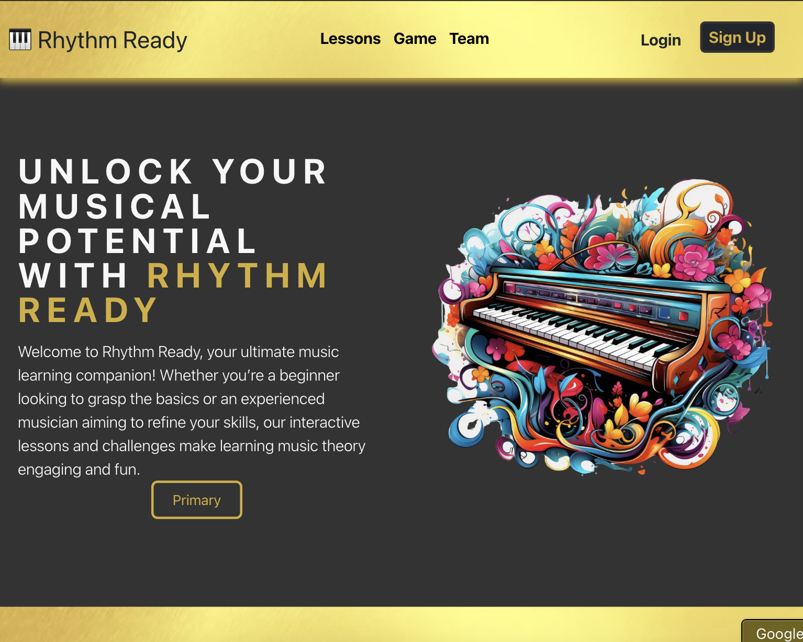
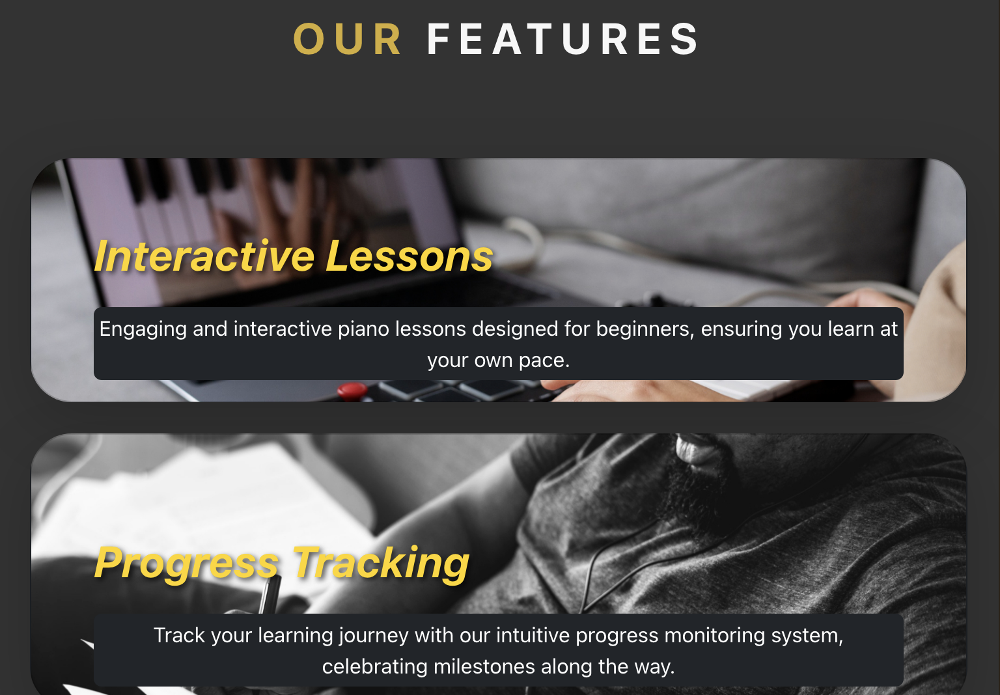
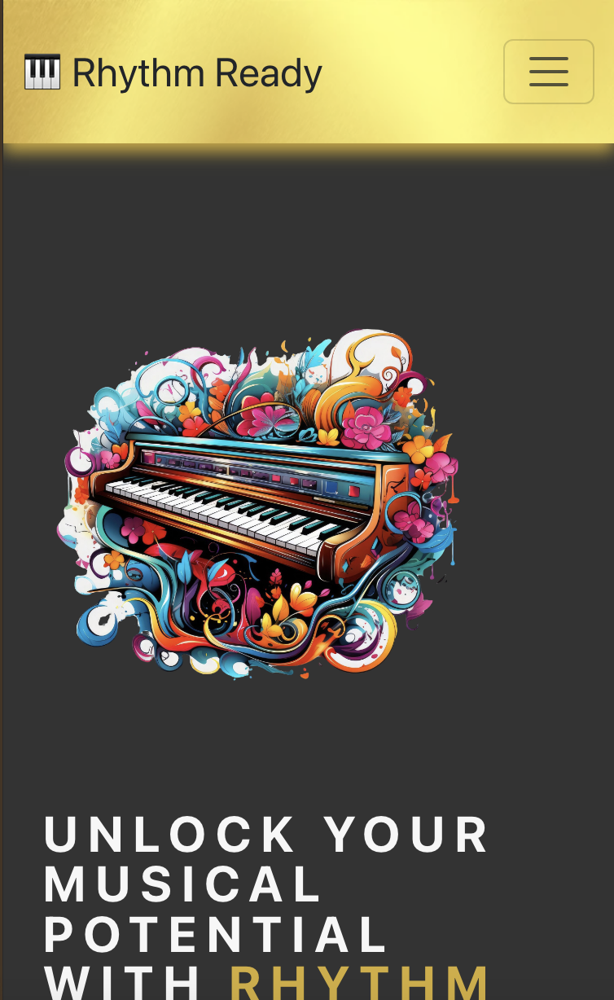

[back to README](./README.md)
# Testing

## Manual Testing

Usability was tested with the below user acceptance testing.

|     | User Actions   | Expected Results | Y/N | Comments  |
|-------------|------------------------|------------------|------|-------------|
| Sign Up     |                        |                  |      |             |
| 1           | Click on sign up button | Bring up registraion page | Y |   n/a  |
| 2           | Click on log in link in the form | Bring up login page | Y |  n/a  |
| 3           | Wrong input | Show warning/error message | Y |  n/a  |
| 4           | Click sign up button | Redirect to homepage with confirmation message | N |  n/a  |
| Log In     |                        |                  |      |             |
| 1           | Click on login button | Bring up login page | Y |   n/a  |
| 2           | Click on sign up link in the form | Bring up registration page | Y |  n/a  |
| 3           | Wrong input | Message shows wrong username or password | N |  n/a  |
| 4           | Click sign in button | Redirect to homepage with confirmation message | N |  n/a  |
| Log Out     |                        |                  |      |             |
| 1           | Click on logout button | Bring up logout page | N |   n/a  |
| 2           | Confirm and click on sign out button | Redirect to homepage with confirmation message | N |   n/a  |
| Home Page     |                        |                  |      |             |
| 1           | Click on logo brand | Bring up home page | Y |   Logo brand on navbar   |
| Lessons Page     |                        |                  |      |             |
| 1           | Click on lessons link on navbar | Bring up lessons page | Y |  n/a   |
| Game Page     |                        |                  |      |             |
| 1           | Click on game link on navbar | Bring up game page | Y |  n/a   |
| 2           | Click on start button | Start challenge and timer | Y |  n/a   |
| 3           | Click on restart button | Restart challenge | Y |  n/a   |
| Team Page     |                        |                  |      |             |
| 1           | Click on team link on navbar | Bring up team page | Y |  n/a   |
| 2           | Click on faces | Redirect to GitHub/LinkedIn profiles | Y |  n/a   |
| Highscore Page     |                        |                  |      |             |
| 1           | Click on highscore link on dropdown menu when logged in | Bring up highscore page | Y |  n/a   |
| 2           | Click on back to game | Redirect to game page | Y |  n/a   |

---

## Testing User Story

| User Goals | Requirement met |
| ------------------------- | --------------- |
| As a user I can navigate the site so that I can find what I'm looking for easily. | Y |
| As a user I can easily see and comprehend the piano on the site so that I can interact with the piano. | Y |
| As a user I can play the piano on the site so that I can learn about piano. | Y |
| As a user I can partake in a challenge so that I can test my knowledge. | Y |
| As a user I can partake in lessons so that I can improve my piano skills. | Y |
| As a user I can view related content to my piano lesson so that I can learn piano effectively. | Y |
| As a user I can navigate to the lesson page so I can find what I'm looking for easily. | Y |
| As a user I can test my skills so that I can determine if I am learning. | Y |
| As a user I can view the team page so that I am aware of who contributed to the application. | Y |
| As a user I can view the site on different devices so I can access the application anywhere | Y |

---

## Validation

### HTML Validation:

The official [W3C](https://validator.w3.org/) validator was used to validate HTML.

#### Homepage
[screenshot]

#### Lessons page
[screenshot]

#### Challenges page
[screenshot]

#### Team page
[screenshot]

#### Higschore page
[screenshot]

### CSS Validation:

The official [W3C (Jigsaw)](https://jigsaw.w3.org/css-validator/#validate_by_uri) validator was used to validate CSS.

#### styles CSS
[screenshot]

#### piano CSS
[screenshot]

#### challenge CSS
[screenshot]

#### lessons CSS
[screenshot]

#### OurTeams CSS
[screenshot]

#### styles CSS
[screenshot]

### JS Validation:

The official [JSHint](https://www.jshint.com/) validator was used to validate JS.

#### main JS
[screenshot]

#### piano JS
[screenshot]

#### challenge JS
[screenshot]

#### lessons JS
[screenshot]

#### toggle JS
[screenshot]

### Python Validation:

Code Institute's [CI Python Linter](https://pep8ci.herokuapp.com/) was used to validate python.

#### users app
[screenshot]

#### challenge app
[screenshot]

#### lessons app
[screenshot]

#### Root/top level (manage.py)
[screenshot]

#### music_hackathon main app
[screenshot settings.py]
[screenshot urls.py]

---

## Lighthouse Report

#### Homepage
[screenshot]

#### Lessons page
[screenshot]

#### Challenges page
[screenshot]

#### Team page
[screenshot]

#### Highscore page
[screenshot]

---

## Responsiveness

Bootstrap was used for the majority of styling and designing the layout and display of the website, which is a responsive mobile first design. The responsiveness was checked manually by using devtools (Chrome) throughout the whole development.

### Desktop

### Tablet

### Phone

---

## Bugs

There were no known bugs at the time of submission of this project.

[back to README](./README.md)